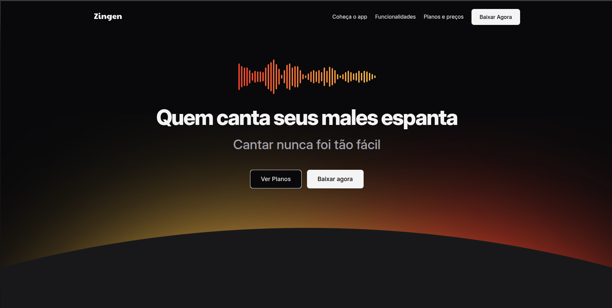

# 🎤 Zingen - Landing Page Responsiva (Estudo de CSS)

## 🔗 Índice

[✨ Visão Geral do Projeto](#visão-geral-do-projeto) | [🖼️ Screenshot do Projeto](#screenshot-do-projeto) | [🎯 Objetivos de Aprendizado](#objetivos-de-aprendizado) | [🚀 Tecnologias Utilizadas](#tecnologias-utilizadas) | [🛠️ Estrutura do Projeto](#estrutura-do-projeto) | [💡 Como Visualizar o Projeto](#como-visualizar-o-projeto)

---

## 🖼️ Screenshot do Projeto

## 

## ✨ Visão Geral do Projeto

Este projeto é um **estudo prático e aprofundado em responsividade de CSS**. Consiste na construção de uma _landing page_ para um aplicativo fictício de karaokê chamado **Zingen**.

O objetivo principal é aprimorar as habilidades na criação de interfaces que se adaptam perfeitamente a diferentes tamanhos de tela, desde dispositivos móveis até desktops, utilizando **apenas HTML e CSS puro**, sem o uso de _frameworks_ ou pré-processadores.

---

## 🎯 Objetivos de Aprendizado

- Dominar o uso de **Media Queries** para aplicar estilos específicos em diferentes _breakpoints_.
- Implementar _layouts_ flexíveis utilizando **Flexbox** e **CSS Grid**.
- Garantir a **fluidez das imagens e mídias** (técnicas como `max-width: 100%`).
- Projetar uma experiência de usuário (UX) otimizada tanto para **mobile-first** quanto para _desktop_.
- Praticar a organização e estruturação de código CSS para grandes projetos.

---

## 🚀 Tecnologias Utilizadas

| Tecnologia | Descrição                                  |
| :--------- | :----------------------------------------- |
| **HTML5**  | Estrutura semântica e acessível da página. |
| **CSS3**   | Estilização e lógica de responsividade.    |

_(Nota: Nenhum JavaScript foi utilizado, pois o foco do projeto é o CSS e a responsividade.)_

---

## 🛠️ Estrutura do Projeto

O projeto está organizado da seguinte forma:

```
zingen-landing-page/
├── index.html          # Estrutura principal da Landing Page
├── css/
│   └── index.css       # Folha de importação dos estilos utilizados
├── assets/
│   ├── icons/         # Icones
└── README.md           # Este arquivo
```

---

## 💡 Como Visualizar o Projeto

Para ver a _landing page_ em ação e testar a responsividade:

1.  **Clone o repositório:**
    ```bash
    git clone [SEU_REPOSITORIO_AQUI]
    ```
2.  **Abra o arquivo:**
    Navegue até a pasta do projeto e abra o arquivo `index.html` em seu navegador preferido.
3.  **Teste a Responsividade:**
    Redimensione a janela do navegador ou use as **Ferramentas do Desenvolvedor** (`F12` ou `Ctrl+Shift+I`) para alternar entre os modos de visualização de celular, tablet e desktop.
